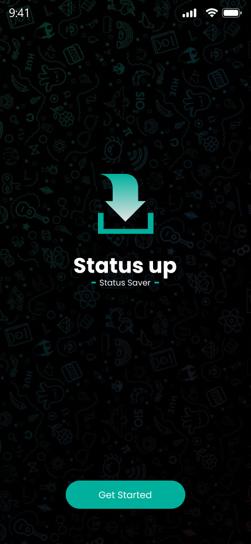
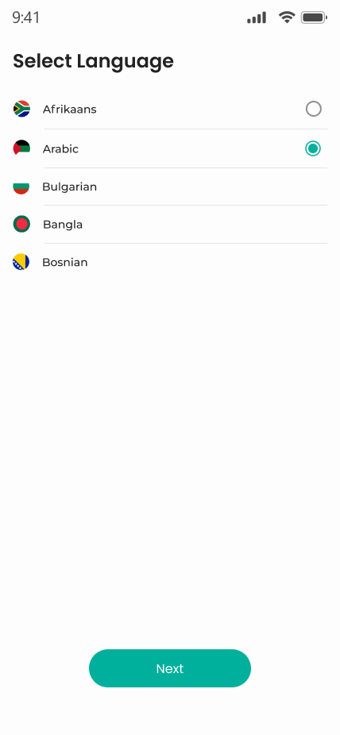
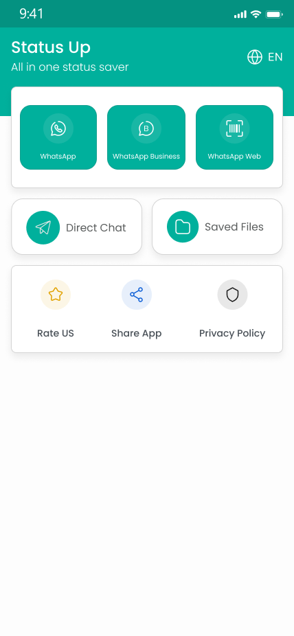
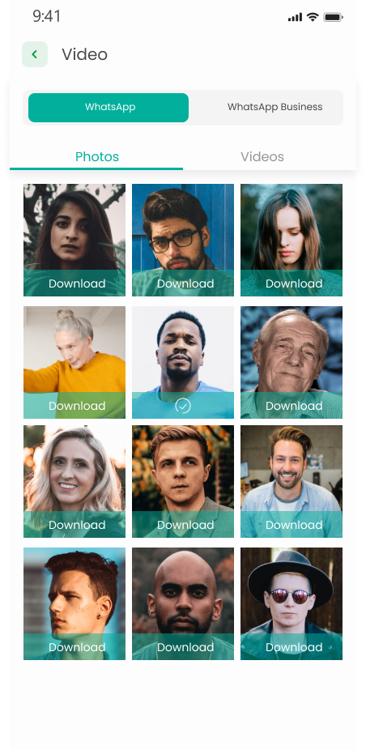
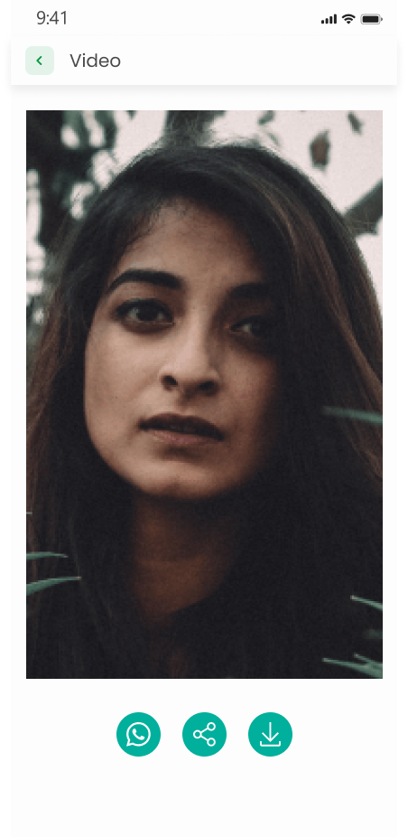

## ✨ Badges


---

## 📱 WhatsApp Status Saver & Message Recovery
Save. Recover. Control your WhatsApp experience.

This Flutter app lets you:
📥 Save WhatsApp Statuses (images & videos) directly to your phone before they disappear.
🕵️ Recover Deleted Messages even after the sender deletes them.
💾 View, manage, and share saved statuses anytime.
🔔 Get instant notifications when someone deletes a message.
🔐 Safe, lightweight, and privacy-friendly—your data stays on your device.

---

### ✨ Features

---

### 🚀 Getting Started

To run this app locally:

```bash
git clone https://github.com/AmrSalahDev/ZappSaver.git
cd zapp_saver
flutter pub get
flutter run
```

---

## 📦 Dependencies Used

Below is a list of packages used in this Flutter project along with their versions:

### 🚀 Core
- `flutter`: Flutter SDK
- `cupertino_icons: ^1.0.8` – iOS-style icons

### 📦 State Management
- `flutter_bloc: ^9.1.1` – Bloc pattern for managing app state

### 🎨 UI Components
- `country_flags: ^3.3.0` – 
- `awesome_dialog: ^3.2.1` – Beautiful animated dialogs
- `chewie: ^1.12.1` – 
- `flutter_svg: ^2.2.0` – SVG image rendering
- `flutter_advanced_drawer: ^1.5.0`
- ` toastification: ^3.0.3` 

### 🔄 Routing
- `go_router: ^16.0.0` – Declarative navigation

### 📷 Media & Camera
- `google_mlkit_barcode_scanning: ^0.14.1` – Barcode scanner using ML Kit
- `qr_code_scanner_plus: ^2.0.10+1` – QR code scanning
- `qr_flutter: ^4.1.0` – Generate QR codes
- `image_picker: ^1.1.2` – Pick images from gallery or camera
- `image_gallery_saver_plus: ^4.0.1` – Save images to gallery

### 📱 Native Features
- `android_intent_plus: ^5.3.0` – Send Android Intents
- `package_info_plus: ^8.3.0` – Get app package information
- `path_provider: ^2.1.5` – Access filesystem paths
- `permission_handler: ^12.0.1` – Request runtime permissions
- `vibration: ^3.1.3` – Control device vibration
- `wifi_iot: ^0.3.19+2` – Manage WiFi connections

### 💾 Data Storage
- `hive: ^2.2.3` – Lightweight key-value database
- `hive_flutter: ^1.1.0` – Hive integration with Flutter
- `hive_generator: ^2.0.1` – Code generation for Hive models

### 🧪 Code Generation & Utilities
- `build_runner: ^2.5.4` – Used for code generation
- `uuid: ^4.5.1` – Generate unique IDs
- `intl: ^0.20.2` – Internationalization and formatting
- `share_plus: ^11.0.0` – Share content with other apps

### 🎨 Figma Design

Here’s the app UI design created in Figma:

[](https://www.figma.com/community/file/1301969973064116680/whatsapp-status-saver-app-ui-kit)

📌 Click the image to view the live Figma prototype.


---

### 📸 Screenshots

<p float="left">
  
  
  
  
  
  
</p>


---

### 🛠️ Contributions

Feel free to fork the repo, open issues, or submit PRs to improve the app!