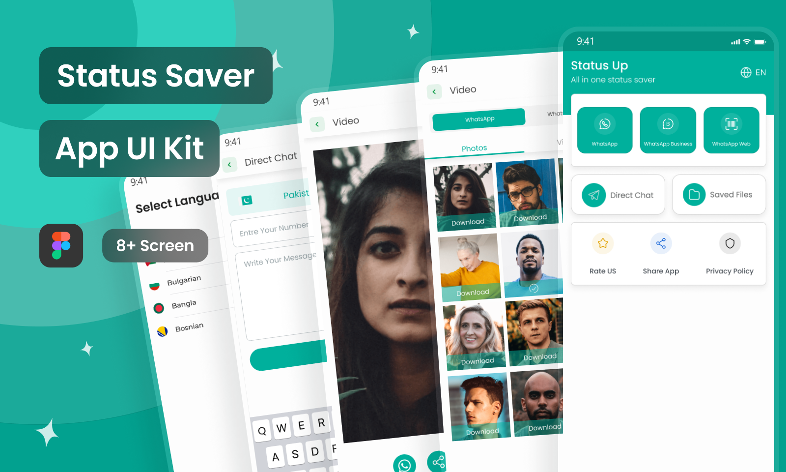

## ✨ Badges


---

## 📱 WhatsApp Status Saver & Message Recovery
Save. Recover. Control your WhatsApp experience.

This Flutter app lets you:
📥 Save WhatsApp Statuses (images & videos) directly to your phone before they disappear.
🕵️ Recover Deleted Messages even after the sender deletes them.
💾 View, manage, and share saved statuses anytime.
🔔 Get instant notifications when someone deletes a message.
🔐 Safe, lightweight, and privacy-friendly—your data stays on your device.

---

### ✨ Features

---

### 🚀 Getting Started

To run this app locally:

```bash
git clone https://github.com/AmrSalahDev/ZappSaver.git
cd zapp_saver
flutter pub get
flutter run
```

---

## 📦 Dependencies Used

Below is a list of the main packages used in this Flutter project:

### 🚀 Core
- **flutter** – Flutter SDK  
- **cupertino_icons: ^1.0.8** – iOS-style icons

### 📦 State Management & Dependency Injection
- **flutter_bloc: ^9.1.1** – Bloc pattern for state management  
- **get_it: ^8.0.3** – Simple dependency injection

### 🎨 UI & Animations
- **awesome_dialog: ^3.2.1** – Beautiful animated dialogs  
- **chewie: ^1.12.1** – Customizable video player  
- **flutter_advanced_drawer: ^1.5.0** – Elegant drawer UI  
- **flutter_svg: ^2.2.0** – SVG rendering  
- **toastification: ^3.0.3** – Toast notification system  
- **country_flags: ^3.3.0** – Country flag icons

### 🔄 Routing & Localization
- **go_router: ^16.0.0** – Declarative navigation  
- **flutter_localization: ^0.3.3** – Localized content support

### 📱 Native Features & Permissions
- **android_intent_plus: ^5.3.0** – Android Intents  
- **path_provider: ^2.1.5** – Access filesystem directories  
- **permission_handler: ^12.0.1** – Manage permissions  
- **shared_preferences: ^2.5.3** – Store key-value pairs  
- **change_app_package_name: ^1.5.0** – Update package names easily  
- **flutter_launcher_icons: ^0.14.4** – Auto-generate launcher icons  
- **notification_listener_service: ^0.3.4** – Listen to WhatsApp notifications

### 📷 Media & File Handling
- **video_player: ^2.10.0** – Play video files  
- **video_thumbnail: ^0.5.6** – Generate video thumbnails  
- **open_filex: ^4.7.0** – Open files using other apps  
- **share_plus: ^11.0.0** – Share content

### 📐 Utilities
- **extension: ^0.6.0** – Useful Dart extension methods

### 📢 Monetization
- **google_mobile_ads: ^6.0.0** – AdMob for in-app ads


### 🎨 Figma Design

Here’s the app UI design created in Figma:

[](https://www.figma.com/community/file/1301969973064116680/whatsapp-status-saver-app-ui-kit)

📌 Click the image to view the live Figma prototype.


---

### 📸 Screenshots

<p float="left">
  
  
  
  
  
  
</p>


---

### 🛠️ Contributions

Feel free to fork the repo, open issues, or submit PRs to improve the app!